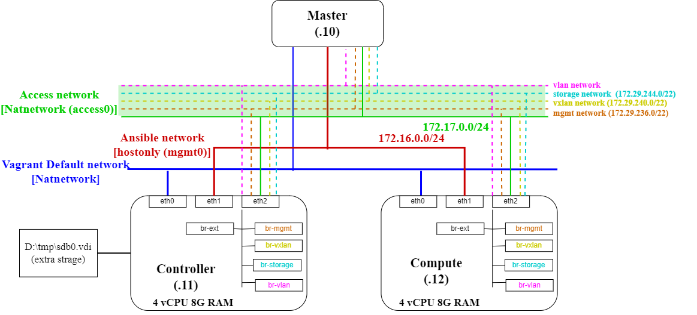

# Vagrantを使ってOpenStack環境を構築．
OpenStackで色々遊ぶ用の環境のメモ

## `lab-devstack`
devstackを使ったAll-in-One構成．

## `lab-openstack-ansible`
[`openstack-ansible`](https://github.com/openstack/openstack-ansible)を使った複数ノードの環境．

### VMの構成

MasterがAnsible実行ノード．




### Playbookの実行
`vagrant up`後，以下のコマンドのようにplaybookを実行し，OpenStackをインストール．
```bash
cd /opt/openstack-ansible/playbooks
sudo openstack-ansible setup-hosts.yml
sudo openstack-ansible setup-infrastructure.yml
sudo openstack-ansible setup-openstack.yml
```


## References
- [OpenStack-Ansibleで構築するOpenStack環境](https://valinux.hatenablog.com/entry/20220908)
- [OpenStack Ussuri をマニュアルインストールしてみたメモ](https://aton-kish.github.io/blog/post/2020/09/11/openstack-ussuri-installation/)
- [OpenStackのチュートリアルをやってみたメモ](https://rohhie.net/notes-from-the-openstack-tutorial-i-did/)
- [devstackとvirtualBoxを使ってOpenStackのお試し環境を構築する](https://www.ois-yokohama.co.jp/oisblog2018/archives/5999)
- [Raspberry PiでOpenStackクラスターを作ってみよう](https://developer.so-tech.co.jp/entry/2022/08/23/113000)